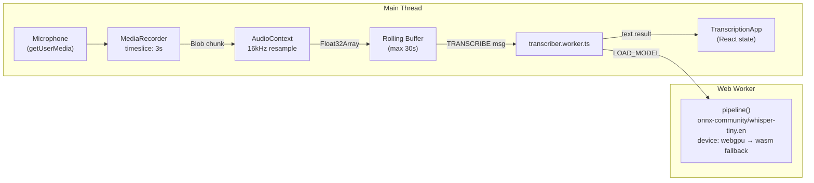

# In-Browser Voice Transcription App

## Stack

- **Next.js 15** (App Router, TypeScript)
- **Tailwind CSS** for styling
- `**@huggingface/transformers`** v3 (stable) — Whisper Tiny.en via ONNX Runtime Web
- **Web Worker** for off-main-thread inference
- **MediaRecorder + AudioContext** for real-time audio capture

## File Structure

```
/
├── next.config.ts              # COOP/COEP headers + webpack fallbacks
├── app/
│   ├── layout.tsx
│   ├── page.tsx
│   └── globals.css
├── components/
│   └── TranscriptionApp.tsx    # 'use client' — UI + worker orchestration
└── workers/
    └── transcriber.worker.ts   # Model loading + inference
```

## Architecture & Data Flow




## Real-Time Streaming Strategy

- `MediaRecorder` fires `ondataavailable` every **3 seconds** with a Blob chunk
- Each chunk is decoded to PCM via `AudioContext` at **16kHz** (Whisper's required sample rate)
- Decoded Float32 samples are **appended to a rolling buffer**, trimmed to the last 30 seconds
- If the worker is **idle** (not already transcribing), the full buffer is sent via `postMessage`
- Worker returns text for the entire buffer → React state updates the displayed transcript
- On **stop**: final transcription of remaining buffer, microphone tracks released

## Key Configuration

`**next.config.ts`** — required for SharedArrayBuffer (WASM multithreading):

```ts
headers: [
  { key: 'Cross-Origin-Opener-Policy', value: 'same-origin' },
  { key: 'Cross-Origin-Embedder-Policy', value: 'require-corp' },
]
```

`**workers/transcriber.worker.ts**` — worker message types:

- `LOAD_MODEL` → loads pipeline with `progress_callback` for download progress
- `TRANSCRIBE` → runs inference on `Float32Array` payload, posts `{ status, text }` back

`**components/TranscriptionApp.tsx**` — worker is instantiated with:

```ts
new Worker(new URL('../workers/transcriber.worker.ts', import.meta.url), { type: 'module' })
```

## UI Design

- **Status badge**: Loading model / Downloading (X%) / Ready / Recording / Transcribing
- **Model download progress bar** (shown only on first load, while model caches to IndexedDB)
- **Large pulsing microphone button** — toggles recording
- **Transcript area** with scrollable live text, "committed" (solid) and "live" (dimmed) segments
- **Copy** and **Clear** action buttons
- Dark-themed, minimal, modern aesthetic with Tailwind

